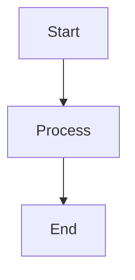
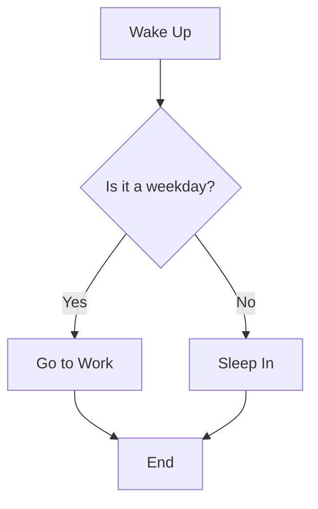
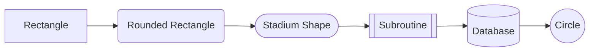
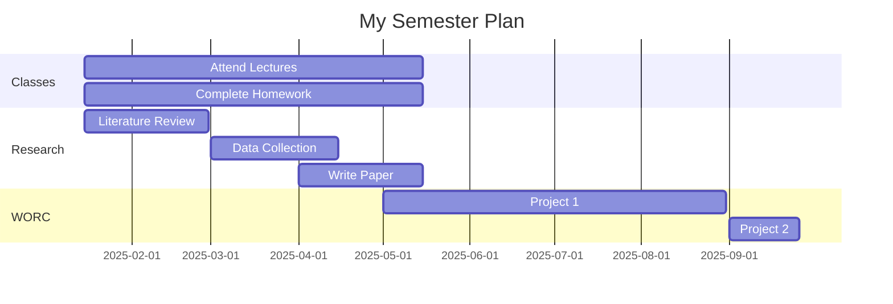

```mermaid
graph TD
    A[Start] --> B[Process]
    B --> C[End]
```

```mermaid
graph TD
    A[Wake Up] --> B{Is it a weekday?}
    B -->|No| D[Sleep In]
    B -->|Yes| C[Go to Work]
    C --> E[End]
    D --> E
```

```mermaid
graph LR
    A[Rectangle] --> B(Rounded Rectangle)
    B --> C([Stadium Shape])
    C --> D[[Subroutine]]
    D --> E[(Database)]
    E --> F((Circle))
```

```mermaid
gantt
    title My Semester Plan
    dateFormat YYYY-MM-DD
    section Classes
    Attend Lectures     :2025-01-15, 2025-05-15
    Complete Homework   :2025-01-15, 2025-05-15
    section Research
    Literature Review   :2025-01-15, 2025-02-28
    Data Collection     :2025-03-01, 2025-04-15
    Write Paper         :2025-04-01, 2025-05-15
    section WORC
    Project 1           :2025-05-01, 2025-08-31
    Project 2           :2025-09-01, 2025-09-26
```
